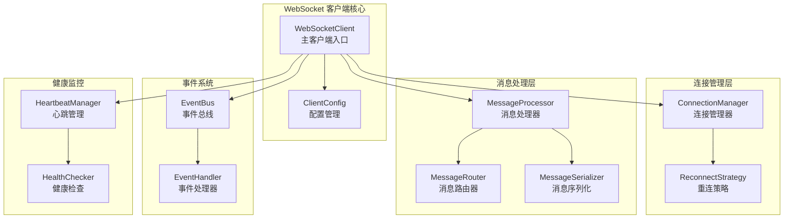

# 通用 WebSocket 客户端

一个用 Rust 实现的功能全面、高性能的异步 WebSocket 客户端库。

## ✨ 主要特性

- 🔄 **自动重连**：智能的重连策略，支持指数退避算法
- 💓 **心跳检测**：自动的 Ping/Pong 心跳机制，确保连接活跃
- 📨 **消息路由**：基于类型的消息路由和处理系统
- 🎯 **事件驱动**：完整的事件发布订阅机制
- 🛡️ **错误恢复**：智能的错误分类和恢复策略
- ⚡ **高性能**：基于 Tokio 的异步架构
- 🔧 **可配置**：灵活的配置选项

## 🏗️ 架构设计



## 🚀 快速开始

### 基本用法

```rust
use websocket::{ClientConfig, WebSocketClient, MessageType};
use std::time::Duration;

#[tokio::main]
async fn main() -> Result<(), Box<dyn std::error::Error>> {
    // 创建配置
    let config = ClientConfig::new("wss://echo.websocket.org")
        .with_connect_timeout(Duration::from_secs(10));

    // 创建客户端
    let client = WebSocketClient::new(config).await?;

    // 注册消息处理器
    client.register_message_handler(MessageType::Data, |message| {
        println!("收到消息: {}", message.payload);
        Ok(())
    }).await;

    // 启动客户端
    client.start().await?;

    // 发送消息
    client.send_data(serde_json::json!({
        "hello": "world"
    })).await?;

    // 运行一段时间后停止
    tokio::time::sleep(Duration::from_secs(10)).await;
    client.stop().await?;

    Ok(())
}
```

### 高级配置

```rust
use websocket::{
    ClientConfig, WebSocketClient,
    config::{ReconnectConfig, HeartbeatConfig, MessageConfig}
};

let config = ClientConfig::new("wss://your-websocket-server.com")
    .with_connect_timeout(Duration::from_secs(10))
    .with_reconnect(ReconnectConfig {
        enabled: true,
        max_retries: Some(5),
        initial_interval: Duration::from_secs(1),
        max_interval: Duration::from_secs(60),
        backoff_multiplier: 2.0,
    })
    .with_heartbeat(HeartbeatConfig {
        enabled: true,
        interval: Duration::from_secs(30),
        timeout: Duration::from_secs(10),
    })
    .with_message_config(MessageConfig {
        max_size: 1024 * 1024, // 1MB
        queue_size: 1000,
    });
```

## 📋 事件处理

```rust
use websocket::WebSocketEvent;

client.register_event_handler("logger", |event: WebSocketEvent| {
    match event {
        WebSocketEvent::Connected => {
            println!("✅ 已连接");
        }
        WebSocketEvent::Disconnected(reason) => {
            println!("❌ 已断开: {:?}", reason);
        }
        WebSocketEvent::Reconnecting(attempt) => {
            println!("🔄 重连中 (第{}次)", attempt);
        }
        WebSocketEvent::MessageReceived(message) => {
            println!("📨 收到: {:?}", message.payload);
        }
        WebSocketEvent::Error(error) => {
            eprintln!("❌ 错误: {}", error);
        }
        _ => {}
    }
    Ok(())
}).await;
```

## 🔧 消息类型

支持多种消息类型：

```rust
use websocket::{Message, MessageType};

// 数据消息
let data_msg = Message::data(serde_json::json!({"key": "value"}));

// 心跳消息
let ping_msg = Message::ping();
let pong_msg = Message::pong();

// 自定义消息类型
let custom_msg = Message::new(
    MessageType::Custom("my_type".to_string()),
    serde_json::json!({"data": "custom"})
).with_id("msg_001");
```

## 🛠️ 运行示例

```bash
# 克隆项目
git clone <项目地址>
cd websocket

# 运行示例
cargo run

# 运行测试
cargo test

# 构建发布版本
cargo build --release
```

## 📊 依赖项

主要依赖：

- `tokio` - 异步运行时
- `tokio-tungstenite` - WebSocket 实现
- `serde` - 序列化/反序列化
- `anyhow` - 错误处理
- `tracing` - 日志记录
- `futures` - 异步工具

## 🤝 贡献

欢迎提交 Issue 和 Pull Request！

## 📄 许可证

本项目采用 MIT 许可证。 