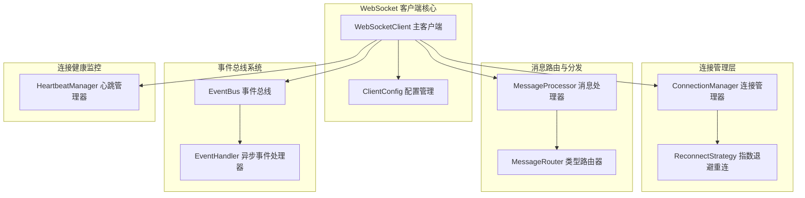

<div align="center">

# WebSocket

**基于 Rust 与 Tokio 的企业级高可靠异步 WebSocket 客户端框架**

[](LICENSE)
[](https://www.rust-lang.org/)
[](https://tokio.rs/)
[](https://github.com/snapview/tokio-tungstenite)

</div>

---

## 📌 项目定位与特性

**WebSocket** 是专为高可靠分布式系统、量化交易行情订阅、实时数据推拉等场景打造的企业级异步 WebSocket 客户端框架。基于 Tokio 与 `tokio-tungstenite` 构建，提供开箱即用的自动重连、心跳保活、事件总线与类型化消息路由机制。

- 🔄 **智能指数退避重连**：连接异常中断时自动触发重连，支持自定义重试次数、初始间隔、最大退避倍数与封顶间隔。
- 💓 **多策略心跳保活**：支持自动定时 Ping/Pong 保活探针与超时感知，避免静默断连与僵尸连接。
- 📨 **类型化消息路由**：支持基于业务类型（Data / Heartbeat / Auth / Custom）注册独立异步分发处理器。
- 🎯 **全局解耦事件总线**：内置轻量级 `EventBus`，支持订阅连接建立、断开、重连状态、消息收发及全局异常。
- ⚡ **无锁并发异步设计**：读写双工分离，基于 Tokio MPSC Channel 实现非阻塞排队发送与高并发处理。
- 🛡️ **优雅停机与资源回收**：支持平滑停止与连接安全断开，保证在途消息不丢失。

---

## 🏗️ 系统架构



---

## 🚀 快速上手

### 1. 添加依赖

在 `Cargo.toml` 中引入：

```toml
[dependencies]
websocket = { git = "https://github.com/zsl99a/websocket.git" }
tokio = { version = "1", features = ["full"] }
serde_json = "1"
```

### 2. 基本使用示例

```rust
use std::time::Duration;
use websocket::{ClientConfig, MessageType, WebSocketClient, WebSocketEvent};

#[tokio::main]
async fn main() -> Result<(), Box<dyn std::error::Error>> {
    // 1. 创建客户端配置
    let config = ClientConfig::new("wss://echo.websocket.org")
        .with_connect_timeout(Duration::from_secs(10));

    // 2. 初始化客户端
    let client = WebSocketClient::new(config).await?;

    // 3. 注册生命周期与连接事件监听
    client.register_event_handler("logger", |event: WebSocketEvent| {
        match event {
            WebSocketEvent::Connected => println!("✅ WebSocket 连接已建立"),
            WebSocketEvent::Disconnected(reason) => println!("❌ 连接断开: {:?}", reason),
            WebSocketEvent::Reconnecting(attempt) => println!("🔄 正在重连 (第 {} 次)...", attempt),
            WebSocketEvent::MessageReceived(msg) => println!("📨 收到消息: {:?}", msg.payload),
            _ => {}
        }
        Ok(())
    }).await;

    // 4. 注册数据消息业务处理器
    client.register_message_handler(MessageType::Data, |message| {
        println!("处理业务数据: {}", message.payload);
        Ok(())
    }).await;

    // 5. 启动客户端与后台消息循环
    client.start().await?;

    // 6. 发送业务 JSON 消息
    client.send_data(serde_json::json!({
        "event": "subscribe",
        "topic": "market_depth"
    })).await?;

    // 运行 10 秒后平滑停止
    tokio::time::sleep(Duration::from_secs(10)).await;
    client.stop().await?;

    Ok(())
}
```

---

## ⚙️ 进阶配置

支持针对企业级生产环境进行精细化调优：

```rust
use std::time::Duration;
use websocket::{
    ClientConfig,
    config::{HeartbeatConfig, MessageConfig, ReconnectConfig}
};

let config = ClientConfig::new("wss://api.example.com/ws")
    .with_connect_timeout(Duration::from_secs(10))
    // 重连策略：开启指数退避，最多重试 5 次，最大间隔 60 秒
    .with_reconnect(ReconnectConfig {
        enabled: true,
        max_retries: Some(5),
        initial_interval: Duration::from_secs(1),
        max_interval: Duration::from_secs(60),
        backoff_multiplier: 2.0,
    })
    // 心跳策略：每 30 秒发送 Ping，10 秒无响应判定超时
    .with_heartbeat(HeartbeatConfig {
        enabled: true,
        interval: Duration::from_secs(30),
        timeout: Duration::from_secs(10),
    })
    // 消息缓存与容量限制
    .with_message_config(MessageConfig {
        max_size: 1024 * 1024, // 1MB 帧上限
        queue_size: 1000,      // 异步队列深度
    });
```

---

## 📋 事件系统（EventBus）

客户端生命周期内的所有动作均通过异步事件总线广播，支持动态注册多个事件处理函数：

| 事件枚举项 | 触发时机 |
| :--- | :--- |
| `Connected` | 底层 WebSocket 握手成功并建立数据流 |
| `Disconnected(reason)` | 连接异常中断或服务端主动断开 |
| `Reconnecting(attempt)` | 触发自动重连机制，携带当前重试轮次 |
| `Reconnected` | 自动重连成功并恢复消息流 |
| `ReconnectFailed(reason)` | 超过最大重试次数或严重不可恢复错误 |
| `MessageReceived(message)` | 接收到完整反序列化消息 |
| `MessageSent(message)` | 消息成功写入底层 TCP/TLS 缓冲区 |
| `HeartbeatSent` / `HeartbeatReceived` | 心跳探针发送与 Pong 应答确认 |
| `HeartbeatTimeout` | 心跳保活超时，将触发连接重置 |
| `Error(error)` | 传输层或协议层异常 |

---

## 🛠️ 构建与测试

确保本地已安装 Rust 1.75+ 工具链：

```bash
# 检查编译状态
cargo check

# 运行单元与集成测试
cargo test

# 运行示例程序
cargo run --bin websocket
```

---

## 📄 开源协议

本项目采用 [MIT 许可证](LICENSE) 开源。
